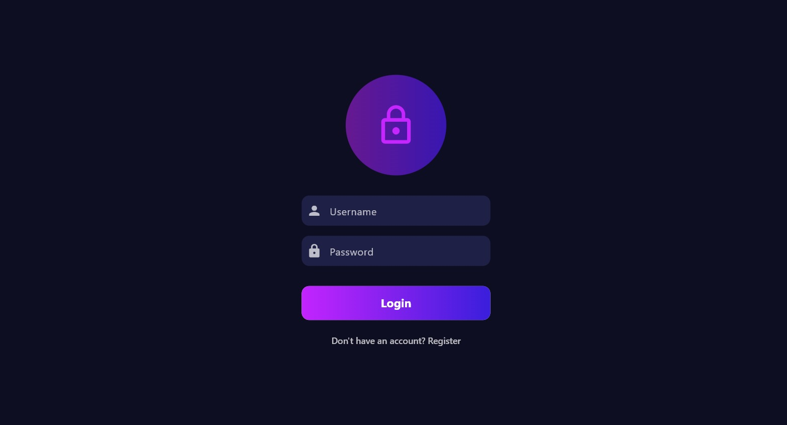
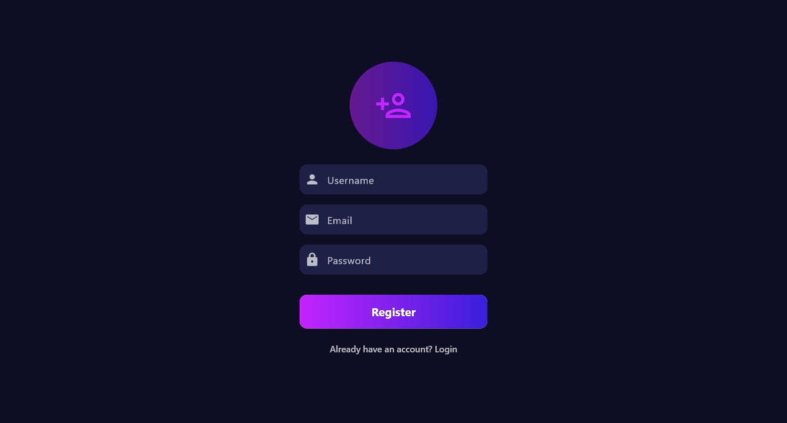
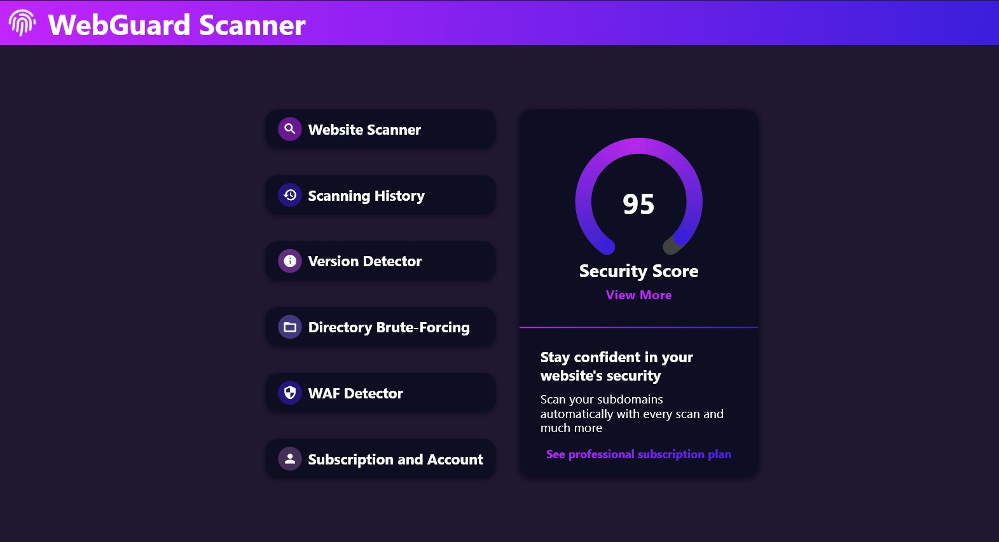
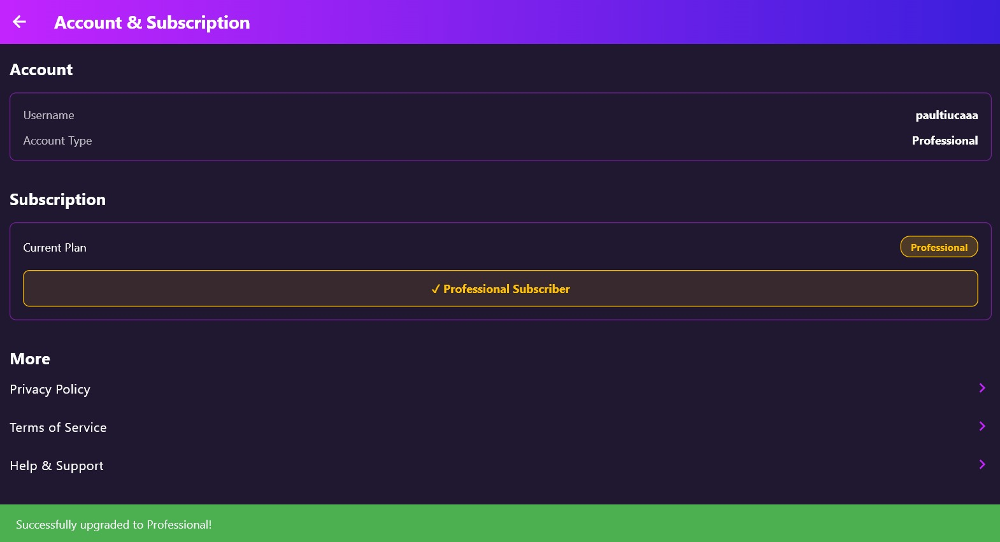
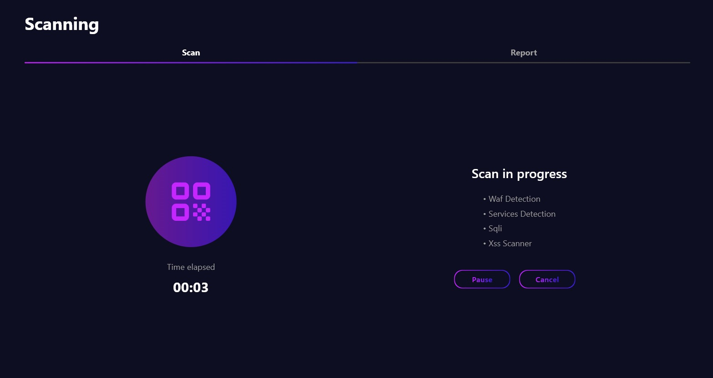
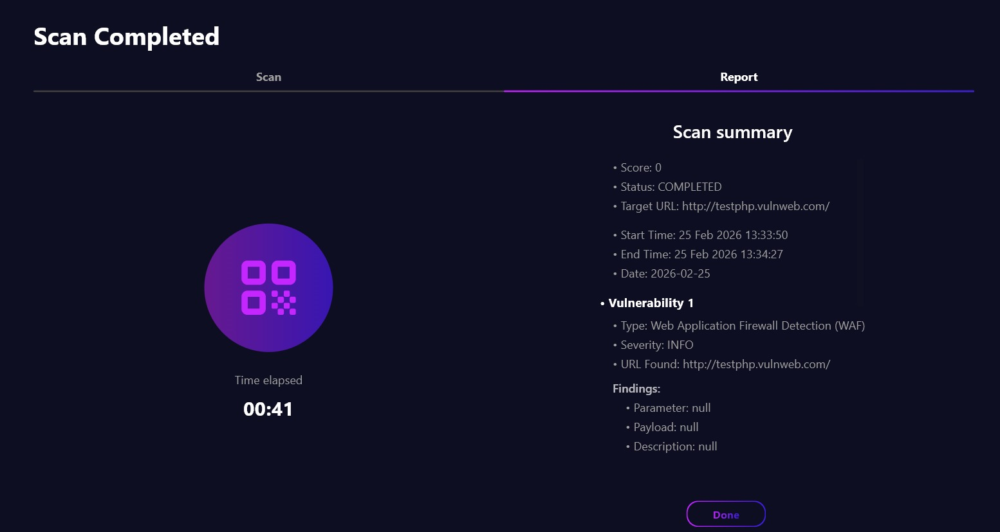
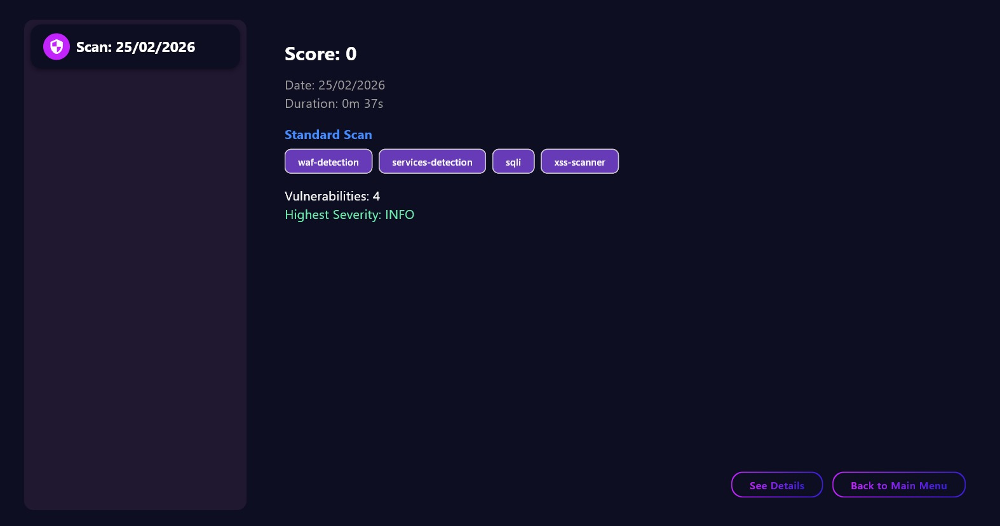
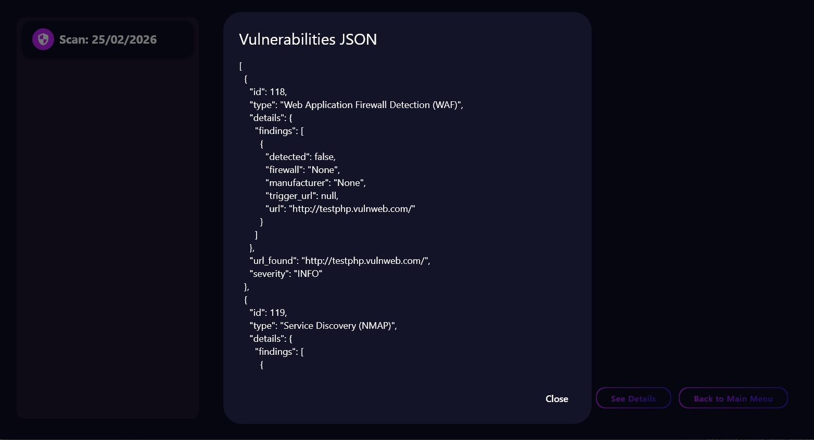

<h1 align="center">🛡️ Web Guard Scanner </h1>

  <strong>Automated Pentesting & Security Orchestration Platform</strong> 
  Built on Kali Linux using Django (Python) and Flutter (Dart)

  <strong> Deveoped by Reti Antonio (Back-end and Design) and Tiuca Paul (Front-end)</strong>

  
  
  
  

---

<h3>📖 Description</h3>

  <b>WebGuard</b> is a full-stack security orchestration platform engineered to automate the critical reconnaissance and initial exploitation phases of a penetration test. 
  By wrapping industry-standard CLI security tools into a modern and responsive interface, allowing security professionals to manage vulnerability assessments through a centralized dashboard.

<h3>📱 Application Preview</h3>

<table width="100%">
  <tr>
    <td align="center" width="25%"><b>Authentication</b></td>
    <td align="center" width="25%"><b>Core Dashboard</b></td>
    <td align="center" width="25%"><b>Scanning Engine</b></td>
     <td align="center" width="25%"><b>History & Analysis</b></td>
  </tr>
  <tr>
   <td>
       
      
   </td>
   <td>
       
      
   </td>
   <td>
        
        
      
   </td>
   <td>
        
       
   </td>
    
  </tr>
  <tr>
    <td align="center"><i>Secure Entry</i></td>
    <td align="center"><i>User Management</i></td>
    <td align="center"><i>Active Assessment</i></td>
    <td align="center"><i>Vulnerability Tracking</i></td>
  </tr>
</table>

<h3>🚀 Core Implementation Features</h3>
<ul>
  <li><b>Modular Scanning Engine:</b> A custom Python orchestration layer that executes and parses output from industry-standard tools:
    <ul>
      <li><b>Sqlmap Modules:</b> Extensible wrappers for automated SQL injection testing and database crawling.</li>
      <li><b>XSStrike Crawling and Brute-Forcing Modules:</b> Extensible wrappers for automated parameterized url brute-forcing and website crawling.</li>
      <li><b>Wafw00f Integration:</b> Automated fingerprinting to detect and identify Web Application Firewalls (WAFs).</li>
      <li><b>Nmap Service Mapping:</b> Deep network analysis including port status, service version detection, and OS fingerprinting.</li>
    </ul>
  </li>
  <li><b>Asynchronous Scan Lifecycle:</b> Non-blocking architecture using <b>Django REST Framework</b> and <b>Celery (Asynchronous Distributed Task Queue)</b> to manage long-running security processes with real-time status tracking (Pending → Running → Completed).</li>
  <li><b>Secure Data Isolation:</b> 
    <ul>
      <li><b>User-Isolated QuerySets:</b> Custom back-end logic ensuring every user can only view and execute scans on their authorized targets.</li>
      <li><b>ID Enumeration Protection:</b> Secure filtering that returns 404s for unauthorized resource access.</li>
    </ul>
  </li>
  <li><b>Robust Error Management:</b> Intelligent handling of subprocess streams to distinguish between "Zero findings" and actual system/network failures (stderr).</li>
  <li><b>Tiered Access Logic:</b> Integrated "Pro" vs "Free" plan system to gate advanced modules like deep crawlers based on user account status.</li>
</ul>

<h3>🛠️ Technical Stack</h3>

<table width="100%">
  <tr>
    <td width="50%">
      <b>Backend (Python)</b>
      <ul>
        <li>Django 5.x & DRF</li>
        <li>Token-Based Authentication</li>
        <li>Subprocess Tool Orchestration</li>
         <li>Celery 5.6.2</li>
      </ul>
    </td>
    <td width="50%">
      <b>Frontend (Flutter)</b>
      <ul>
        <li>Asynchronous Polling Engine</li>
        <li>Secure Token Storage</li>
        <li>Dynamic and Animated Dashboard UI</li>
      </ul>
    </td>
  </tr>
</table>

<h3>⚠️ Security Disclaimer</h3>

  <i>This tool is for educational purposes and authorized security testing only. The author is not responsible for any misuse or damage caused by this application. Always obtain written permission before scanning any target.</i>

